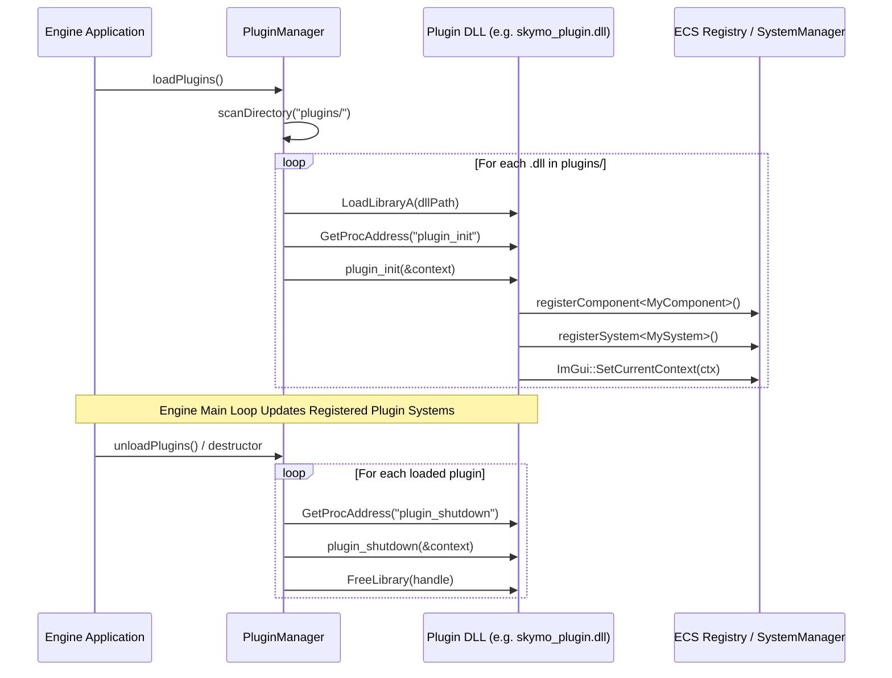

# Dynamic Plugin Architecture

This document describes the design, API, and lifecycle of the engine's dynamic runtime **Plugin System**. The plugin subsystem allows game mechanics, environmental systems, AI modules, and editor tools to be compiled into independent shared libraries (`.dll` on Windows / `.so` on Linux) and loaded dynamically into the engine at runtime.

---

## 1. Architectural Motivation

As game engines expand, monolithic compilation introduces significant friction:
* **Long Link Times**: Minor changes in gameplay scripts or specialized subsystems (such as atmosphere simulation or pathfinding) force relinking of the entire engine executable.
* **Tight Coupling**: Monolithic engines tend to leak subsystem headers across domains.
* **Extensibility**: Third-party tools, camera modules, or procedural generators should be modular add-ons that can be distributed independently or excluded from lightweight standalone builds.

To solve this, the engine implements a C ABI dynamic plugin interface managed by [`PluginManager`](../engine/include/core/PluginManager.hpp).

---

## 2. Core Plugin API (`Plugin.hpp`)

The plugin boundary communicates through a minimalist C-compatible ABI defined in [`Plugin.hpp`](../engine/include/core/Plugin.hpp):

```cpp
#ifdef _WIN32
    #define PLUGIN_API extern "C" __declspec(dllexport)
#else
    #define PLUGIN_API extern "C"
#endif

/**
 * @struct PluginContext
 * @brief State container passed to dynamic libraries upon initialization.
 */
struct PluginContext {
    Registry* registry;
    SystemManager* systemManager;
    VulkanRenderer* renderer;
    EditorModeState* editorMode;
    ImGuiContext* imguiContext;
};

typedef void (*PluginInitFunc)(PluginContext*);
typedef void (*PluginShutdownFunc)(PluginContext*);
```

### Context Components
* **`Registry*`**: Pointer to the central ECS entity and component store.
* **`SystemManager*`**: Allows plugins to register custom logic systems into the main engine tick loop.
* **`VulkanRenderer*`**: Gives plugins access to rendering buffers, textures, shader pipelines, and custom render features.
* **`EditorModeState*`**: Exposes editor vs. play mode transitions and viewport flags.
* **`ImGuiContext*`**: Synchronizes ImGui's internal context pointer across the DLL boundary, allowing plugins to render native ImGui inspector widgets and custom windows.

---

## 3. Plugin Lifecycle & PluginManager

[`PluginManager`](../engine/include/core/PluginManager.hpp) oversees the scanning, loading, initialization, and unloading of shared libraries.



### 1. Discovery & Loading
On engine initialization:
1. `PluginManager::setExeDirectory(dir)` resolves the base folder of the executable.
2. `PluginManager::loadPlugins()` scans the relative `plugins/` directory for dynamic library files (`*.dll` on Windows).
3. For each discovered binary, `LoadLibraryA` (or `dlopen`) loads the shared library into the process address space.

### 2. Initialization Handshake (`plugin_init`)
`PluginManager` searches for the exported C symbol `plugin_init`:
* Populates a `PluginContext` instance with references to the active engine state.
* Calls `plugin_init(&context)`.
* Inside `plugin_init`, the plugin sets the shared `ImGui::SetCurrentContext(context->imguiContext)` to enable seamless GUI rendering.
* The plugin registers its custom ECS components with reflection descriptors and registers its systems with `SystemManager`.

### 3. Graceful Teardown (`plugin_shutdown`)
When the engine shuts down (or during hot-reloading):
1. `PluginManager::unloadPlugins()` is called.
2. For each loaded plugin, `plugin_shutdown` is called to unregister systems, free allocated GPU resources, and release memory.
3. `FreeLibrary` unmaps the DLL from the process address space.

---

## 4. Dynamic Inspector & Component UI Registration

Plugins often define custom components that require custom GUI controls in the editor. To avoid tight coupling with `EditorUI`, `EditorUI` provides dynamic callback hooks:

```cpp
// Dynamic UI Registration in EditorUI.hpp
using ComponentInspectorCallback = std::function<void(Registry&, Entity)>;
using ComponentAddCallback = std::function<void(Registry&, Entity)>;

EditorUI::registerComponentInspector(const std::string& name, ComponentInspectorCallback callback);
EditorUI::registerComponentAddCallback(const std::string& name, ComponentAddCallback callback);
```

When a plugin loads, it registers inspector drawing lambdas for its components. Whenever an entity holding that component is selected in the Editor Inspector, `EditorUI` dynamically invokes the registered callback.

---

## 5. Built-in Engine Plugins

The engine ships with three production-grade dynamic plugins located under the `plugins/` directory:

| Plugin Name | Output Binary | Description | Subsystems & Features |
|---|---|---|---|
| **Skymo** | `skymo_plugin.dll` | Atmospheric Scattering & Dynamic Weather | Bruneton/Hillaire sky LUTs, volumetric clouds, volumetric fog, rain, snow, lightning strikes, thunder audio. See [Skymo Documentation](skymo_system.md). |
| **Cinemachine** | `cinemachine_plugin.dll` | Procedural Virtual Cameras | 3rd-person follow, 1st-person bone lock, fixed look-at, 2D orthographic tracking, damping, priority blending. See [Cinemachine Documentation](cinemachine_system.md). |
| **AStar** | `astar_plugin.dll` | 2D/3D Grid & Tilemap Pathfinding | A* navigation agent, tilemap navigation, 3D GridWorld voxel traversal, diagonal cost heuristics. See [GridWorld Documentation](tilemap_and_gridworld_system.md). |

---

## 6. How to Create a New Plugin

### Step 1: Write the Plugin Code (`MyPlugin.cpp`)

```cpp
#include "core/Plugin.hpp"
#include "ecs/System.hpp"
#include "meta/ComponentReflection.hpp"
#include <iostream>

// Define component
// [ReflectClass("Gameplay/Health")]
struct HealthComponent {
    // [ReflectField]
    float currentHealth = 100.0f;
    // [ReflectField]
    float maxHealth = 100.0f;
};
REGISTER_COMPONENT(HealthComponent, "Gameplay/Health");

// Define system
class HealthSystem : public System {
public:
    const char* getName() const override { return "HealthSystem"; }
    HealthSystem(Registry& reg) : registry(reg) {}

    void update(float dt) override {
        // System logic here
    }

private:
    Registry& registry;
};

// Export plugin lifecycle hooks
PLUGIN_API void plugin_init(PluginContext* context) {
    std::cout << "[MyPlugin] Initializing..." << std::endl;
    ImGui::SetCurrentContext(context->imguiContext);

    // Register system
    context->systemManager->registerSystem<HealthSystem>(*context->registry);
}

PLUGIN_API void plugin_shutdown(PluginContext* context) {
    std::cout << "[MyPlugin] Shutting down..." << std::endl;
}
```

### Step 2: Configure CMake (`CMakeLists.txt`)

```cmake
add_library(my_plugin SHARED
    src/MyPlugin.cpp
)

target_include_directories(my_plugin PRIVATE
    ${ENGINE_INCLUDE_DIR}
    ${THIRDPARTY_INCLUDE_DIR}
)

target_link_libraries(my_plugin PRIVATE
    engine
    glfw
    glm::glm
    imgui
)

# Output directly to plugins/ directory
set_target_properties(my_plugin PROPERTIES
    RUNTIME_OUTPUT_DIRECTORY "${CMAKE_BINARY_DIR}/plugins"
)
```

### Step 3: Run and Verify
When the editor launches, `PluginManager` logs:
```text
[PluginManager] Scanning directory: plugins/
[PluginManager] Loading plugin: plugins/my_plugin.dll
[MyPlugin] Initializing...
[PluginManager] Successfully loaded plugin: plugins/my_plugin.dll
```
The new components and systems become immediately usable in the editor and runtime scenes.
