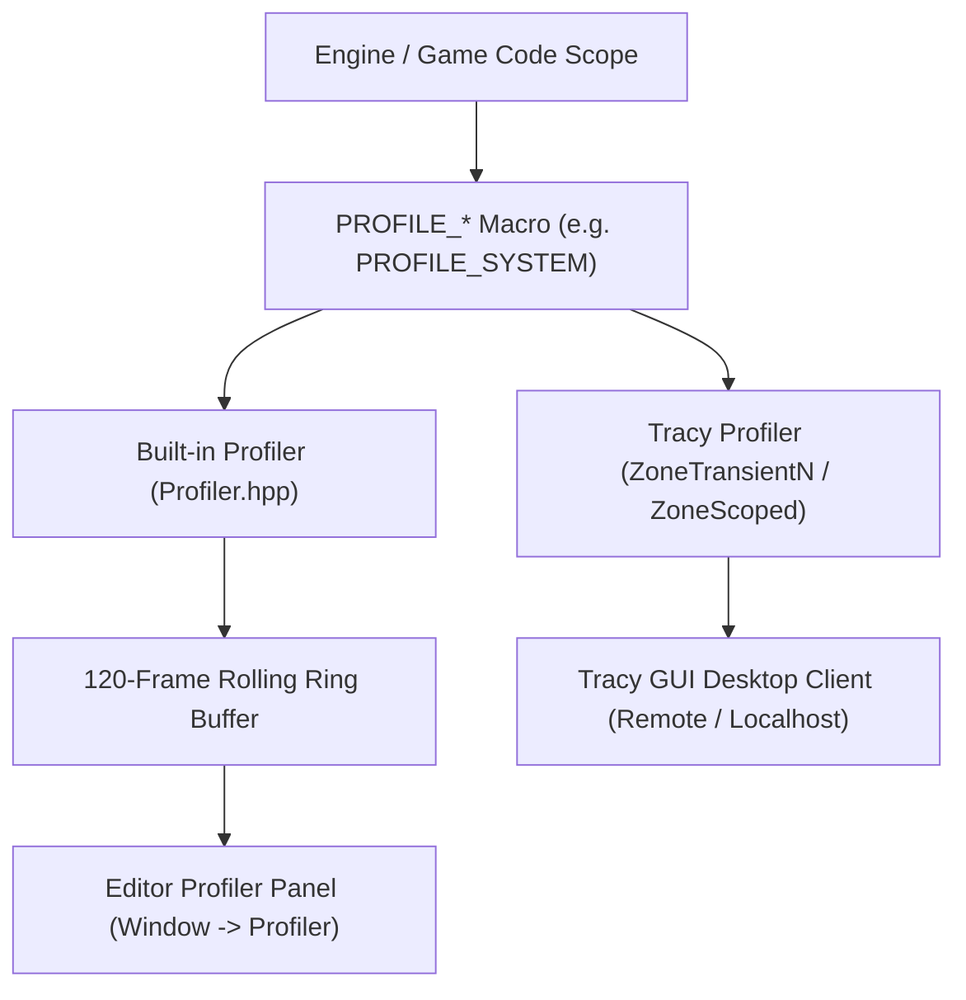

# Engine Profiler & Tracy Integration

This document describes the design, API, and workflow of the engine's profiling architecture, implemented in [`Profiler.hpp`](../engine/include/profiler/Profiler.hpp). The engine incorporates a unified dual-profiling model featuring a built-in interactive editor profiler and seamless deep integration with the **Tracy Profiler**.

---

## 1. Dual Profiling Architecture

High-performance game development requires both immediate in-engine metrics and deep microsecond-level flame graphs:



1. **In-Engine Profiler**: Lightweight, zero-overhead recording available directly in development builds. Displays frame rates, system breakdowns, and scene metrics inside the editor.
2. **Tracy Profiler Integration**: When compiled with `TRACY_ENABLE`, macro invocations automatically feed Tracy instrumentation zones, enabling full callstack sampling, lock contention analysis, and microsecond thread timelines in the external Tracy GUI.

---

## 2. The Profiler API & Profiling Macros

Instrumentation is performed using RAII macros defined in [`Profiler.hpp`](../engine/include/profiler/Profiler.hpp). The macros expand to instrument both Tracy and the internal engine profiler simultaneously:

| Macro | Description | Target Category |
|---|---|---|
| `PROFILE_FUNCTION()` | Profiles the enclosing function scope (using `__FUNCSIG__` / `__PRETTY_FUNCTION__`). | `ProfileCategory::Custom` |
| `PROFILE_SYSTEM("Name")` | Profiles an entire ECS system's `update(dt)` step. | `ProfileCategory::Systems` |
| `PROFILE_RENDERING("Pass")` | Instruments rendering passes and GPU buffer uploads. | `ProfileCategory::Rendering` |
| `PROFILE_PHYSICS("Step")` | Instruments physics broadphase, narrowphase, and integration. | `ProfileCategory::Physics` |
| `PROFILE_ECS("Op")` | Instruments entity spawning, recycling, and component queries. | `ProfileCategory::ECS_Core` |
| `PROFILE_EDITOR_UI("Panel")` | Instruments ImGui panel layouts and gizmo calculations. | `ProfileCategory::Editor_UI` |
| `PROFILE_SCOPE("ScopeName")` | Arbitrary custom scoped code block. | `ProfileCategory::Custom` |

### Code Example

```cpp
void PhysicsSystem::update(float dt) {
    PROFILE_SYSTEM("PhysicsSystem");

    {
        PROFILE_PHYSICS("Broadphase Bounding Volumes");
        // Bounding volume checks...
    }

    {
        PROFILE_PHYSICS("Narrowphase SAT & Solver");
        // Collision impulse resolution...
    }
}
```

---

## 3. In-Engine Profiler Window (`Window -> Profiler`)

The editor UI features a comprehensive profiling panel (`drawProfilerPanel`):

```
+-------------------------------------------------------------------------------+
| Profiler                                               [Pause]  [Clear]  Frame: 1420  |
+-------------------------------------------------------------------------------+
| FPS: 144.2  |  Frame Time: 6.93 ms  (Min: 6.12 ms | Max: 8.45 ms | Avg: 6.88 ms)     |
| [=================== Frame Time Category Breakdown =========================] |
| [ Rendering 42% ] [ Systems 28% ] [ Physics 18% ] [ ECS 4% ] [ UI 8% ]       |
+-------------------------------------------------------------------------------+
| System Name            | Calls | Last (ms) | Avg (ms)  | Min (ms)  | Max (ms)  | % Share |
|------------------------+-------+-----------+-----------+-----------+-----------+---------|
| RenderSystem           | 1     | 2.91 ms   | 2.85 ms   | 2.40 ms   | 3.60 ms   | 42.0%   |
| TerrainSystem          | 1     | 1.15 ms   | 1.10 ms   | 0.90 ms   | 1.80 ms   | 16.6%   |
| PhysicsSystem          | 1     | 1.25 ms   | 1.20 ms   | 1.10 ms   | 1.50 ms   | 18.0%   |
| SkymoAtmosphereSystem  | 1     | 0.45 ms   | 0.42 ms   | 0.35 ms   | 0.60 ms   |  6.5%   |
| GridWorldSystem        | 1     | 0.32 ms   | 0.30 ms   | 0.25 ms   | 0.45 ms   |  4.6%   |
+-------------------------------------------------------------------------------+
| Render Statistics:                                                            |
|  - Draw Calls: 48        - Triangles: 245,120     - Vertices: 380,410         |
|  - Entities: 1,240       - Components: 3,480      - Mesh VRAM: 14.8 MB        |
+-------------------------------------------------------------------------------+
```

### Key Window Capabilities
* **120-Frame Scrubber**: Pause the engine and scrub through recent frames to diagnose sudden lag spikes.
* **Category Color Breakdown**: Visual horizontal bar graph displaying relative time consumption between Rendering, Physics, Systems, ECS, and UI.
* **Render Statistics**: Real-time tracking of draw calls, triangle counts, vertex buffers, entity counts, and mesh VRAM consumption.

---

## 4. Tracy Profiler External Workflow

To perform deep nanosecond-level profiling with callstacks:

1. **Build with Tracy Enabled**:
   Compile the engine with Tracy profiling turned on (`-DTRACY_ENABLE=ON` in CMake).
2. **Launch Tracy GUI Client**:
   Run the Tracy profiler application (`tracy-profiler.exe`).
3. **Connect to Engine**:
   Launch the engine (`build/Release/editor.exe`). Tracy automatically detects the active engine process on `localhost` (port 8086).
4. **Analyze Flame Graphs**:
   * Inspect multi-threaded job system worker execution.
   * View thread context switches, lock contentions, and memory allocations.
