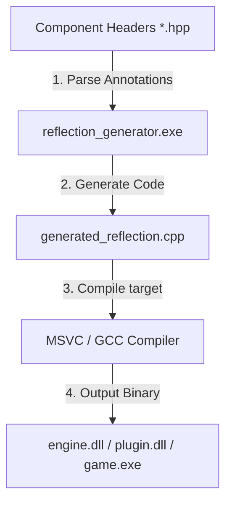
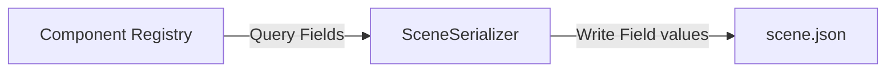

# Static Reflection & Serialization Subsystem

This document details the design, pipeline, and integration of the engine's **Static Reflection System**. Built to overcome the lack of native runtime reflection in C++, this subsystem enables automatic component serialization to JSON, dynamic ImGui inspector rendering, and plugin component registration without manual field mappings.

---

## 1. Why Static Reflection?

In standard C++, there is no built-in way to query a class's member variables at runtime. Traditional solutions introduce undesirable trade-offs:
*   **Manual Mapping**: Manually writing serialization and UI functions for every component is highly error-prone and leads to severe boilerplate bloat.
*   **Runtime RTTI**: Standard C++ Run-Time Type Information is slow, limited, and does not expose member variables or structures.
*   **Dynamic Heap Reflection**: Storing field data in dynamic runtime maps incurs high heap-allocation and memory-indirection overhead.

Our engine implements a **Compile-Time Static Reflection** model:
1.  Components are marked with macro annotations.
2.  A custom build tool parses these annotations.
3.  The tool generates C++ metadata files containing type descriptors and compile-time member offsets (`offsetof`).
4.  The engine queries this static metadata at runtime with zero heap allocations or performance penalties.

---

## 2. Annotation & Syntax

To register a component and its fields with the reflection engine, developers place comments and registration macros inside component headers:

```cpp
// [ReflectClass("Environment/Weather")]
struct WeatherComponent {
    // [ReflectField]
    WeatherType type = WeatherType::Clear;
    // [ReflectField]
    float precipitationIntensity = 0.0f;
    // [ReflectField]
    glm::vec2 windDirection{ 1.0f, 0.0f };
    // [ReflectField]
    bool autoWetness = true;
};

REGISTER_COMPONENT(WeatherComponent, "Environment/Weather");
```

### Key Annotations & Supported Types
*   `// [ReflectClass("Category/Display Name")]`: Marks a class/struct for scanning and sets its categorized placement in the editor's "Add Component" menu (e.g. `"Rendering & Lights/Sprite Renderer"`, `"Camera/Cinemachine Virtual Camera"`).
*   `// [ReflectField]`: Marks the member variable immediately following the comment to be parsed.
*   `// [ReflectStruct]`: Marks helper nested structures (e.g., `AtmosphereDensityProfile`, `DetailPrototype`).
*   `// [ReflectEnum]`: Marks an enum for reflection, generating dropdown string lists (`enumOptions`).

### Supported Field Types ([`FieldType`](../engine/include/meta/ComponentReflection.hpp))
* **Primitives**: `Float`, `Int`, `Bool`.
* **Math Vectors**: `Vec2`, `Vec3`, `Vec4`.
* **Strings & Handles**: `String`, `Entity`.
* **Enumerations (`Enum`)**: Automatically rendered as ImGui dropdown combos.
* **Nested Structures (`Struct`)**: Automatically rendered as nested collapsible tree nodes with recursive subfield inspection.

---

## 3. Code Generation Pipeline (`reflection_generator`)

The compilation pipeline separates reflection code generation from core compilation:



### Execution Flow
During the pre-build or custom-build step, the custom `reflection_generator` executable parses the component header files:
1.  **Header Scanner**: Scans designated include paths for `// [ReflectClass]`, `// [ReflectStruct]`, and `// [ReflectField]` annotations.
2.  **Metadata Baking**: Resolves field offsets (`offsetof(Struct, Field)`), enum names, and nested subfields.
3.  **Code Output**: Generates `generated_reflection.cpp`, containing static registration code:

```cpp
// Example of generated metadata code
void registerGeneratedReflection() {
    {
        Engine::ComponentReflection refl;
        refl.name = "WeatherComponent";
        refl.category = "Environment";
        refl.displayName = "Weather";
        refl.fields = {
            { "precipitationIntensity", Engine::FieldType::Float, offsetof(WeatherComponent, precipitationIntensity) },
            { "windDirection", Engine::FieldType::Vec2, offsetof(WeatherComponent, windDirection) },
            { "autoWetness", Engine::FieldType::Bool, offsetof(WeatherComponent, autoWetness) }
        };
        refl.add = [](Registry& reg, Entity e) { reg.emplace<WeatherComponent>(e, WeatherComponent{}); };
        refl.has = [](Registry& reg, Entity e) { return reg.has<WeatherComponent>(e); };
        refl.remove = [](Registry& reg, Entity e) { reg.remove<WeatherComponent>(e); };
        refl.get = [](Registry& reg, Entity e) { return static_cast<void*>(reg.get<WeatherComponent>(e)); };
        Engine::ComponentReflectionRegistry::getInstance().registerComponent(refl);
    }
}
```

---

## 4. Scene Serialization Integration

The `SceneSerializer` leverages reflection metadata to save and load scenes to JSON automatically:



### Automatic Field Serialization
For every entity in the registry:
1.  The serializer loops over all registered component types.
2.  If the entity possesses the component, the serializer retrieves its reflection descriptor list.
3.  For each field descriptor, it reads the value directly from the component memory block using the computed field offset.
4.  The value is converted to a JSON key-value pair based on its registered type (floats, ints, strings, arrays for vectors, nested objects for structs).

During scene loading, this process is reversed: the serializer instantiates the component in the ECS registry and writes the loaded JSON values into the component's memory offsets.

---

## 5. Editor UI Property Drawer

The interactive **Inspector Panel** in the editor uses the same reflection descriptors to render field controls dynamically:

*   **`Float` / `Int`**: Renders `ImGui::DragFloat` or `ImGui::DragInt` inputs.
*   **`Vec2` / `Vec3` / `Vec4`**: Renders labeled color-coded axis controls.
*   **`Bool`**: Renders an interactive checkbox (`ImGui::Checkbox`).
*   **`String`**: Renders an `ImGui::InputText` input.
*   **`Enum`**: Renders an `ImGui::Combo` dropdown using `enumOptions`.
*   **`Struct`**: Renders an `ImGui::TreeNode` that recursively unfolds all nested fields.

---

## 6. Dynamic Plugin Reflection Registration

When a dynamic plugin (such as `skymo_plugin.dll` or `cinemachine_plugin.dll`) is loaded at runtime:
1. The plugin contains its own pre-baked `generated_reflection.cpp`.
2. Inside `plugin_init(PluginContext* context)`, the plugin registers its components into the shared `ComponentReflectionRegistry` and `ComponentSerializerRegistry`.
3. The editor immediately recognizes the new components: they appear in the "Add Component" menu under their designated category, their fields become inspectable in the inspector, and scenes save and load them automatically.
