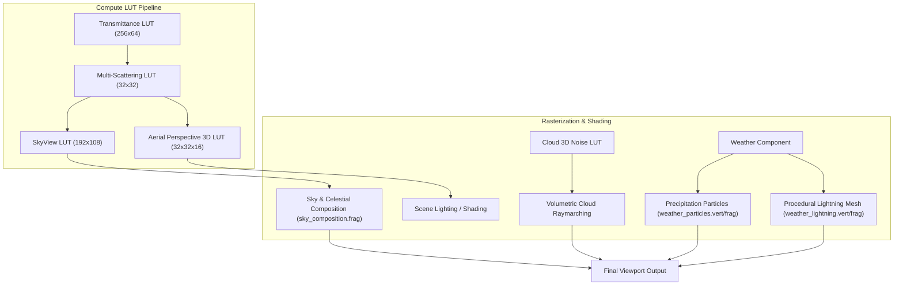

# Skymo: Atmospheric Scattering, Volumetric Clouds & Dynamic Weather

This document provides a comprehensive technical overview of **Skymo**, the engine's physically based atmospheric simulation and dynamic weather plugin (`plugins/skymo`). Skymo renders realistic planetary atmospheres, volumetric raymarched clouds, volumetric height fog, and dynamic weather phenomena (rain, snow, thunderstorms, ground wetness, and spatialized environmental audio).

---

## 1. System Architecture Overview

Skymo is integrated as a dynamic plugin (`skymo_plugin.dll`) and an engine `RenderFeature` (`AtmosphereRenderFeature`). It bridges compute-driven look-up table (LUT) simulations with Vulkan graphics pipelines:

---

## 2. Physically Based Atmosphere Simulation

Skymo models planetary light scattering using the **Bruneton & Neyret (2008)** and **Sébastien Hillaire (2020)** physical models.

### Atmospheric Components (`AtmosphereComponent.hpp`)
* **Planet Dimensions**: Configured with Earth dimensions by default—planet radius \(R_{bottom} = 6,371\,\text{km}\) and atmosphere top boundary \(R_{top} = 6,471\,\text{km}\) (a 100 km atmospheric mantle).
* **Rayleigh Scattering**: Molecular air scattering which favors short wavelengths (blue light). Defined by wavelength-dependent scattering coefficients:
  \[
  \beta_R = (5.802 \times 10^{-6},\, 13.558 \times 10^{-6},\, 33.100 \times 10^{-6})\,\text{m}^{-1}
  \]
* **Mie Scattering**: Aerosol and particulate scattering (dust, haze) that produces intense forward scattering around the sun disc (governed by Cornette-Shanks / Henyey-Greenstein phase function with anisotropy \(g \approx 0.8\)).
* **Ozone Layer Absorption**: Chappuis absorption band modeling ozone peak density at \(25\,\text{km}\) altitude, absorbing orange-red light and producing realistic deep twilight blues.

### Precomputed Atmospheric LUTs (Compute Shaders)
To maintain 60+ FPS while simulating multiple orders of atmospheric scattering, Skymo computes four real-time LUTs using Vulkan compute shaders:
1. **Transmittance LUT (`transmittance.comp`)**:
   * Resolution: \(256 \times 64\) (R16G16B16A16_SFLOAT).
   * Maps viewing altitude \(r\) and zenith angle \(\mu\) to the optical transmittance between any atmospheric point and the top boundary.
2. **Multi-Scattering LUT (`multiscatter.comp`)**:
   * Resolution: \(32 \times 32\) (R16G16B16A16_SFLOAT).
   * Approximates infinite light bounces between atmospheric molecules and ground reflection, preventing shadows from turning pitch black during twilight.
3. **SkyView LUT (`skyview.comp`)**:
   * Resolution: \(192 \times 108\) (R16G16B16A16_SFLOAT).
   * Parameterized by view zenith angle and sun-view azimuth angle. Evaluated every frame for the active camera position, delivering real-time skydome color at negligible rasterization cost.
4. **Aerial Perspective 3D LUT (`aerial_perspective.comp`)**:
   * Resolution: \(32 \times 32 \times 16\) (3D texture volume).
   * Slices camera view frustum space into depth layers to provide distant mountains and geometry with realistic atmospheric depth haze and in-scattering.

---

## 3. Celestial Bodies & Night Sky

Skymo automatically transitions between day and night cycles based on the scene's directional light rotation:

### 1. Solar Disc & Horizon Color
* Procedural sun disc rendered with precise angular radius (`sunAngularRadius = 0.004675` rad \(\approx 0.53^\circ\)).
* Limb darkening and solar irradiance scaling during sunrise and sunset.

### 2. Moon & Phases
* **Procedural Moon Disc**: Renders with realistic texture albedo (`moon_albedo.jpg`) and angular radius (`moonAngularRadius = 0.025` rad).
* **Dynamic Moon Phase (`moonPhase`)**: Ranges from \(-1.0\) (New Moon) to \(0.0\) (First/Third Quarter) to \(+1.0\) (Full Moon), dynamically shaping the illuminated crescent using spherical dot-product evaluation.
* **Auto Direction**: Automatically positions the moon opposite the sun (`autoMoonDirection = true`).

### 3. Procedural Starfield
* Analytical 3D pseudo-random hash distribution projected onto the celestial sphere.
* Real-time scintillation / twinkling driven by `starTwinkleSpeed` and high-frequency noise.

---

## 4. Volumetric Clouds (`VolumetricCloudComponent.hpp`)

Skymo features real-time 3D raymarched volumetric cloud decks:

### Features & Parameters
* **Cloud Deck Altitude**: Bounded between `bottomAltitude` (default \(1,200\,\text{m}\)) and `topAltitude` (default \(3,800\,\text{m}\)).
* **Coverage & Density**: `coverage` (\(0.0\) clear to \(1.0\) overcast) and `density` scaling.
* **3D Noise Modeling**: Driven by a precomputed 3D Perlin-Worley noise texture (`cloud_noise.comp`), producing realistic cumulus cauliflower billows eroded by high-frequency curl noise.
* **Lighting Effects**: Dual-lobe Henyey-Greenstein phase function for forward silver-lining effects and Beer-Lambert extinction with powder-sugar dark-edge simulation.

### Weather Presets (`CloudPreset`)
The inspector exposes one-click presets that instantly configure altitude, density, and coverage:
* `ClearSky`: Minimal cloud presence (\(\text{coverage} = 0.05\)).
* `FairWeather`: Small, scattered cumulus clouds (\(\text{coverage} = 0.25\)).
* `Scattered`: Moderate fluffy cloud cover (\(\text{coverage} = 0.45\)).
* `Broken`: Dense cloud cover with occasional sun breaks (\(\text{coverage} = 0.70\)).
* `Overcast`: Continuous gray cloud ceiling (\(\text{coverage} = 0.95\)).
* `Stormy`: Dark, low-altitude thunderhead deck with high optical extinction.

---

## 5. Volumetric Height Fog (`VolumetricFogComponent.hpp`)

* **Exponential Height Attenuation**: Fog density decreases exponentially with altitude:
  \[
  \rho(y) = \rho_0 \cdot e^{-\lambda (y - y_{ground})}
  \]
* **Frustum Raymarching**: Computes in-scattering and extinction along camera view rays, combining seamlessly with the sky dome and aerial perspective volume.

---

## 6. Dynamic Weather & Storm Simulation (`WeatherComponent.hpp`)

The weather system simulates atmospheric precipitation, physical ground response, and audiovisual thunderstorm events:

### Precipitation Types
* **`Clear`**: Dry conditions; ground wetness gradually evaporates.
* **`Rain`**: Instanced particle streaks (`weather_particles.vert`/`.frag`) aligned with wind direction vectors.
* **`Snow`**: Drifting, fluttering snowflake billboards with rotational turbulence.
* **`Storm`**: Intense torrential downpour with reduced visibility and thunderstorm simulation.

### Ground Wetness & Puddle Dynamics
* **Automatic Accumulation (`autoWetness = true`)**:
  * During active rain/storm, surface wetness accumulates at `wetnessAccumSpeed` (default \(0.12/\text{s}\)).
  * In sunny/clear weather, water evaporates at `dryingSpeed` (default \(0.04/\text{s}\)).
* Wetness modifies ground shader roughness and specular reflectivity, creating puddles that reflect ambient sky light.

### Thunderstorm & Lightning Engine
* **Procedural Bolt Generation**: Computes branching 3D lightning meshes with recursive segment jitter (`weather_lightning.vert`/`.frag`).
* **Dynamic Environmental Flash**: Instantly elevates ambient sky irradiance and casts intense shadowless light on scene geometry for 100–300 milliseconds during a strike.
* **Spatialized Audio**:
  * Continuous rain loop (`rain_loop.wav`).
  * Distant thunder rumbles (`thunder_distant.wav`).
  * Close, violent lightning strike claps (`thunder_strike.mp3`) with randomized delay simulating the speed of sound.
