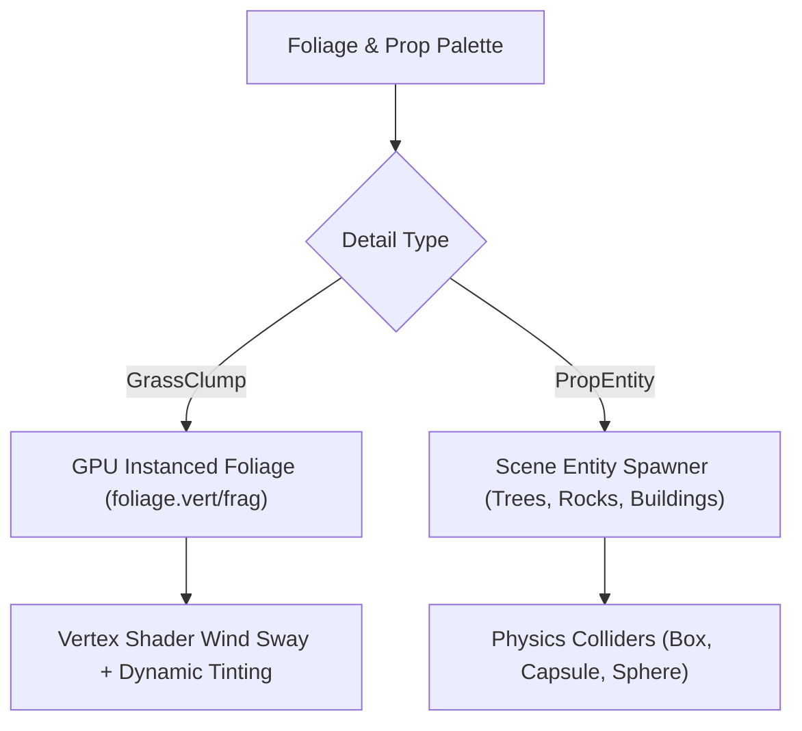

# Terrain & Foliage System

This document provides a comprehensive technical guide to the engine's **Terrain & Foliage Engine**, implemented in [`TerrainComponent.hpp`](../engine/include/ecs/components/TerrainComponent.hpp), [`TerrainChunkComponent.hpp`](../engine/include/ecs/components/TerrainChunkComponent.hpp), and [`TerrainSystem.hpp`](../engine/include/ecs/systems/TerrainSystem.hpp). The system provides real-time viewport terrain sculpting, multi-layer texture splatting, seamless multi-tile border stitching, and a hybrid foliage system combining GPU-instanced swaying vegetation with interactive scene props.

---

## 1. Architecture & Chunked Mesh Design

To handle massive outdoor environments at high framerates while allowing interactive deformation in the editor, terrains are organized into **Submesh Chunks**:

```mermaid
graph TD
    TC[TerrainComponent (Central Entity)] --> Grid["Chunk Grid (e.g. 4x4 Chunks)"]
    Grid --> C1["Chunk (0,0) - AABB + Local Buffers"]
    Grid --> C2["Chunk (0,1) - AABB + Local Buffers"]
    Grid --> C3["Chunk (1,0) - AABB + Local Buffers"]
    Grid --> C4["Chunk (1,1) - AABB + Local Buffers"]

    C1 --> Culling["Frustum Culling (TerrainSystem)"]
    C2 --> Culling
    C3 --> Culling
    C4 --> Culling

    Culling --> Render["Draw Visible Chunks (terrain.vert / terrain.frag)"]
    Deform["Editor Sculpt Stroke"] --> Partial["Partial GPU Buffer Upload (Only Dirty Chunks)"]
    Partial --> Render
```

### Why Submesh Chunks?
1. **Frustum Culling**: Entire chunks outside the camera's view frustum are skipped, avoiding unnecessary vertex shader execution.
2. **Partial GPU Uploads**: When sculpting a small hill, only the chunks overlapping the brush radius are re-uploaded to VRAM. The rest of the terrain mesh stays untouched.
3. **Data Uniformity**: Chunks are internal data structures belonging to the single `TerrainComponent` entity rather than separate ECS entities, preventing ECS hierarchy bloat.

---

## 2. Interactive Viewport Sculpting

The editor provides a real-time circular brush overlay in the 3D viewport. Mouse dragging deforms the heightfield according to the selected brush mode and mathematical falloff curve:

### Brush Modes (`TerrainBrushMode`)
* **`Raise`**: Elevates vertices inside the brush radius toward positive Y.
* **`Lower`**: Depresses vertices toward negative Y.
* **`Smooth`**: Averages vertex heights with neighboring vertices to soften cliffs and ridgelines.
* **`Flatten`**: Gradually pulls all vertices within the radius toward a target plateau height (sampled at the initial click position).
* **`Noise`**: Injects randomized fractal displacement to create rough, natural terrain variations.

### Falloff Curves (`TerrainBrushFalloff`)
* **`Smooth`**: Cubic Hermite smoothstep (\(3t^2 - 2t^3\)) providing \(C^1\) continuity at brush boundaries.
* **`Linear`**: Direct linear attenuation (\(1 - \frac{d}{r}\)).
* **`Spherical`**: Hemispherical circular falloff (\(\sqrt{1 - (d/r)^2}\)).
* **`Flat`**: Uniform step function with no edge attenuation, forming sharp cylindrical plateaus.

---

## 3. Multi-Layer Texture Splatting

Terrains support layered materials defined by [`TerrainLayer`](../engine/include/ecs/components/TerrainComponent.hpp):

### Layer Structure
Each layer defines:
* **Albedo Texture**: Base color map (e.g., Grass, Dirt, Rock, Sand, Snow).
* **Normal Texture**: Tangent-space surface normals for micro-detail lighting.
* **Tint Color & UV Scale**: World-space tiling frequency (e.g., `uvScale = 0.05` repeats every 20 meters).
* **PBR Properties**: Physical roughness and metallic factors.

### Splatmap Evaluation (`terrain.frag`)
* Surface blending is driven by a multi-channel splatmap texture.
* In the fragment shader, layer albedos and normal maps are sampled at their respective world UV scales and blended using normalized splat weights.
* Slope-based auto-texturing automatically applies rock materials to vertical cliff faces and sand/grass to flat valleys based on surface normal dot products (\(\vec{n} \cdot \vec{up}\)).

---

## 4. Multi-Tile Terrain Stitching (`synchronizeNeighborBorders`)

For sprawling open worlds, multiple terrain tiles can be placed side-by-side in a spatial grid:

* **The Seam Problem**: Sculpting one terrain tile near its edge leaves a gap or tearing artifact with adjacent unedited tiles.
* **Automated Stitching Algorithm**:
  [`TerrainSystem::synchronizeNeighborBorders`](../engine/include/ecs/systems/TerrainSystem.hpp) scans neighboring terrain entities in the ECS registry:
  * Detects shared North/South and East/West boundary coordinates.
  * When `copyFromNeighborsToTarget = true` (tile creation): Initializes new tile edges from pre-existing neighbors.
  * During active sculpting: Averages shared boundary vertex heights and normals, updating both tiles simultaneously and eliminating seam cracks.

---

## 5. Hybrid Foliage & Prop System

To populate terrains efficiently, the engine implements a dual-layer vegetation architecture:



### 1. GPU Instanced Vegetation (`DetailType::GrassClump`)
* **High Performance**: Renders hundreds of thousands of swaying grass tufts in a single instanced draw call (`vkCmdDrawIndexed`).
* **Instance Layout (`FoliageInstanceGPU`)**:
  * `positionAndScale` (\(XYZW\)): World position and uniform scale factor.
  * `rotationAndWind` (\(XYZW\)): Yaw rotation, wind phase offset, sway amplitude.
  * `color` (\(RGBA\)): Ground-matched color tint.
* **Vertex Wind Animation (`foliage.vert`)**: Uses sinusoids modulated by vertex height to bend grass blades realistically according to global wind vectors.

### 2. Scene Prop Spawner (`DetailType::PropEntity`)
* **Spawns Real ECS Entities**: Used for substantial objects such as trees, boulders, fences, and structures.
* **Rule-Based Placement**:
  * **Slope Cutoff (`maxSlope`)**: Prevents trees from growing on steep cliffs.
  * **Target Layer Filtering (`targetLayer`)**: Restricts props to specific textures (e.g., sea shells only on sand, pine trees only on dirt).
  * **Normal Alignment (`alignToNormal`)**: Trees stay vertical (\(Y\)-up), while rocks align to slope angles.
  * **Physics Generation**: Automatically attaches rigid bodies and primitive colliders (`DetailCollisionShape::Capsule`, `Box`, or `Sphere`).

---

## 6. Raycasting & Surface Queries

For character movement, projectile hits, and editor brush placement, `TerrainSystem::raycast` provides fast surface intersections:
1. **Broadphase**: Tests ray against chunk AABB bounding boxes to eliminate off-target chunks.
2. **Narrowphase**: Performs Möller–Trumbore ray-triangle intersections against vertices in candidate chunks.
3. **Output**: Returns world-space hit point \((X, Y, Z)\) and normalized local terrain coordinates \((U, V)\).
