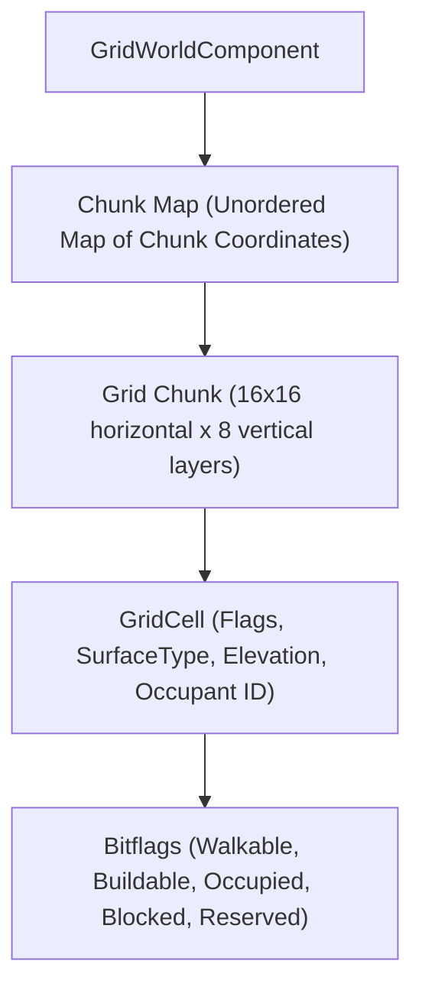

# Infinite GridWorld & 2D/3D Tilemap System

This document outlines the architecture, algorithms, and editor toolsets of the **GridWorld and Tilemap Engine**, implemented in [`GridWorldComponent.hpp`](../engine/include/ecs/components/GridWorldComponent.hpp), [`GridWorldSystem.hpp`](../engine/include/ecs/systems/GridWorldSystem.hpp), [`Tilemap.hpp`](../engine/include/ecs/components/Tilemap.hpp), and the A* pathfinding plugin ([`AStarSystem.hpp`](../plugins/AStar/include/AStarSystem.hpp)).

---

## 1. System Overview

The engine provides dual spatial grid implementations suited for different game genres:
1. **3D GridWorld Engine**: Designed for city builders, voxel simulations, colony sims, and 3D farming games where entities occupy stepped vertical elevations on an infinite 3D grid.
2. **2D Multi-Layer Tilemap Engine**: Optimized for top-down and side-scrolling 2D games, featuring multi-layer rendering (Ground, Obstacles, Decoration), sprite sheet slicing, and automated animation baking.

---

## 2. 3D GridWorld Architecture (`GridWorldComponent.hpp`)

Unlike simple flat 2D grids, `GridWorldComponent` stores 3D spatial voxel cells arranged in infinite horizontal chunks:



### Chunk Dimensions & Memory Layout
* Each chunk spans **\(16 \times 16\)** horizontal cells and **8** vertical elevation steps.
* Chunks are allocated on-demand via spatial hashing (`std::unordered_map<uint64_t, GridChunk>`), creating an unbounded infinite world.

### Cell State & Bitflags (`GridCellFlags`)
Every individual cell contains:
* **`GridCell_Buildable`**: Surface is eligible for building structures.
* **`GridCell_Walkable`**: Traversable by navigation agents.
* **`GridCell_Occupied`**: Contains a placed building, wall, or object (`occupantId` links to the occupying entity).
* **`GridCell_Blocked`**: Permanent natural obstacle (deep water, cliff).
* **`GridCell_Reserved`**: Temporarily reserved by a queued builder task.
* **`customData[4]`**: 4-byte payload available for gameplay logic (e.g., soil moisture, crop growth stage).

---

## 3. Fast 3D Voxel DDA Raycasting (`raycastGrid`)

To select and build on grid cells accurately from the camera viewport, [`GridWorldSystem`](../engine/include/ecs/systems/GridWorldSystem.hpp) implements the **Amanatides & Woo Fast Voxel Traversal algorithm (DDA)**:

```mermaid
graph LR
    Ray[Camera Mouse Ray] --> Step0[Initialize Step Directions & tMax / tDelta]
    Step0 --> Step1[Traverse Next Closest Voxel Boundary]
    Step1 --> Check{Cell Non-Empty?}
    Check -->|No| Step1
    Check -->|Yes| Hit[Return GridRaycastHit (CellCoord, HitPoint, HitNormal)]
```

### Advantages of 3D Voxel DDA
* **Zero Missing / Skewing**: Unlike naive fixed-step raymarching, DDA tests every single voxel the ray pierces, guaranteeing that thin walls or elevation stairs are never skipped.
* **Immediate Normal Calculation**: Detects the exact face of entry (\(+X, -X, +Y, -Y, +Z, -Z\)), enabling instant placement on top of or adjacent to existing structures.

---

## 4. 2D Multi-Layer Tilemaps & Tilesets

For 2D projects, the engine provides high-performance multi-layer tilemaps:
* **Layer Hierarchy**: Multi-layer separation allows rendering ground terrain, structural walls, and foreground overlays (e.g. tree canopies) with proper sorting orders.
* **Infinite Chunk Allocation**: Chunks allocate dynamically as tiles are painted away from the world origin.
* **Tileset Asset Integration (`TilesetAsset.hpp`)**: Links texture atlases with tile IDs, collision masks, and auto-tiling rules.

---

## 5. Editor 2D Tooling: Spritesheet Slicer & Animator

Under `Window -> Sprite Sheet Slicer` and `Window -> Spritesheet to Animations`, the editor provides automated 2D asset workflows:

### 1. Sprite Sheet Slicer
* Loads single-texture sprite sheets and slices them into discrete PNG sprites based on cell width and height (e.g., \(16 \times 16\) or \(32 \times 32\)).
* **Auto-Trim Empty Tiles**: Automatically analyzes alpha channels and discards blank transparent frames.

### 2. Spritesheet to Animation Converter
* Automatically bakes animation frames into the engine's binary `.anim` format.
* Configures clip names, frame rates, and start frame indices.
* Binds directly to [`SpriteRenderer`](../engine/include/ecs/components/SpriteRenderer.hpp) for instant playback in play mode.

---

## 6. A* Pathfinding (`AStarSystem.hpp`)

The bundled A* plugin (`astar_plugin.dll`) navigates both 2D tilemaps and 3D GridWorlds:

```cpp
// [ReflectClass]
struct AStarAgent {
    AStarNavMode navMode = AStarNavMode::Auto; // 2D Tilemap or 3D GridWorld
    Entity targetTransform = Entity();        // Target entity to pursue
    float speed = 2.0f;                       // Movement speed
    bool allowDiagonal = true;                // 8-directional vs 4-directional
    int maxElevationStep = 1;                 // Maximum climbable height delta
    float turnSpeed = 10.0f;                  // Turning interpolation speed
    bool showDebugPath = true;                // Viewport path debug line
};
```

### Heuristics & Performance
* Uses **Euclidean** or **Octile** distance heuristics for smooth diagonal traversal.
* Incorporates repath cooldown timers to prevent path calculation stalls when a target is momentarily unreachable.
* Renders real-time color-coded path lines in the editor viewport during debug sessions.
