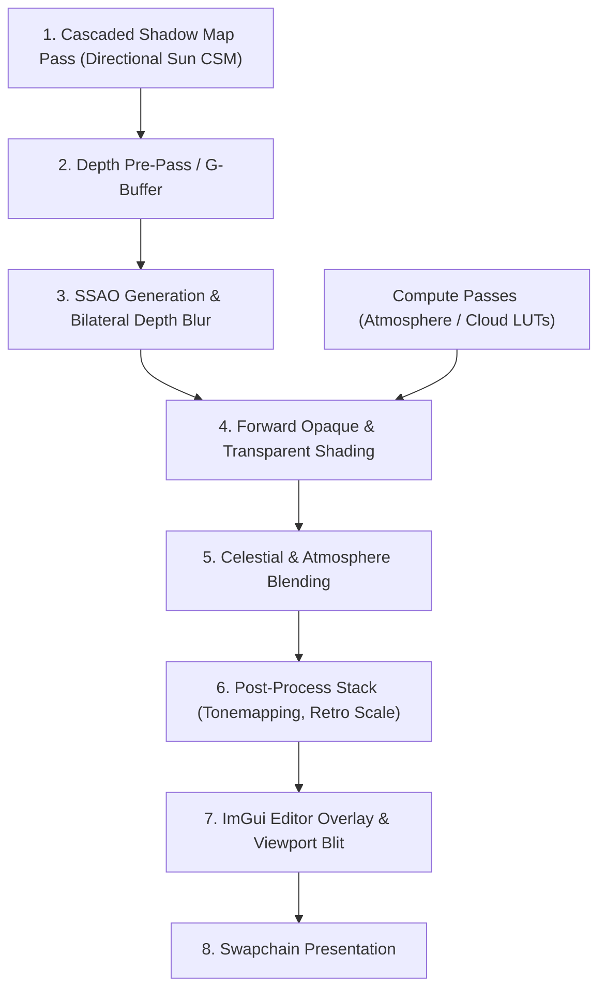

# Vulkan Rendering Engine

This document details the graphics architecture of the Vulkan Renderer. The renderer is designed to abstract raw Vulkan API complexity into clean, RAII C++ wrapper classes while preserving performance, supporting instanced drawing, Cascaded Shadow Maps (CSM), compute shader passes, Screen-Space Ambient Occlusion (SSAO), and a modular post-processing pipeline.


---

## 1. Vulkan Abstraction Layer

Vulkan requires explicit declaration of resources, layouts, synchronization, and hardware access. The engine implements a set of object-oriented C++ classes under `engine/src/core/` to safely encapsulate Vulkan handles:

*   **[VulkanContext](../engine/src/core/VulkanContext.hpp)**: Stores instance-wide structures, validation layer callbacks, and physical device enumerations.
*   **[VulkanDevice](../engine/src/core/VulkanDevice.hpp)**: Handles hardware physical device selection (prioritizing discrete GPUs) and logical device creation. Configures queue families for graphics, presentation, compute, and transfers.
*   **[VulkanSwapchain](../engine/src/core/VulkanSwapChain.hpp)**: Manages screen resolution changes, double-buffering image chains, render pass configurations, swapchain image views, and framebuffers.
*   **[VulkanPipeline](../engine/src/core/VulkanPipeline.hpp)**: Coordinates shader layout state bindings, viewport/scissor setup, depth/stencil tests, color blending, rasterization, and multi-sampling configurations.
*   **[VulkanBuffer](../engine/src/core/VulkanBuffer.hpp)**: Encapsulates `VkBuffer` allocation and `VkDeviceMemory` binding. Supports staging allocations, GPU-local transfer operations, and persistent host mapping.
*   **[VulkanDescriptors](../engine/src/core/VulkanDescriptors.hpp)**: Standardizes descriptor layouts, bindings, pools, and set allocations for camera matrices, compute LUTs, and global uniforms.
*   **[VulkanCommandManager](../engine/src/core/VulkanCommandManager.hpp)**: Creates command pools and records frame buffer command sequences. Supports one-time command buffer execution for staging buffer uploads.
*   **[VulkanFrameSync](../engine/src/core/VulkanFrameSync.hpp)**: Holds CPU-GPU synchronization elements, preventing race conditions via fences and swapchain image-acquisition semaphores.

---

## 2. Double-Buffered Frame Synchronization

To prevent the CPU from submitting draw commands faster than the GPU can process them, the engine coordinates double-buffering using [VulkanFrameSync.hpp](../engine/src/core/VulkanFrameSync.hpp):

```cpp
struct VulkanFrameSync {
    std::vector<VkSemaphore> imageAvailableSemaphores; // GPU-GPU: image is ready for rendering
    std::vector<VkSemaphore> renderFinishedSemaphores; // GPU-GPU: rendering completed, ready to present
    std::vector<VkFence>     inFlightFences;           // CPU-GPU: CPU waits for frame to finish on GPU
};
```

### The Render Loop Sync Protocol
1.  **Wait for Frame Fence**: Wait on `inFlightFence` (`vkWaitForFences`) to guarantee GPU completion of the target frame slot.
2.  **Acquire Next Image**: Request swapchain image using `vkAcquireNextImageKHR` with `imageAvailableSemaphore`.
3.  **Reset Fence**: `vkResetFences` to lock the current slot.
4.  **Submit Command Buffer**: Submit recorded commands (`vkQueueSubmit`), waiting on `imageAvailableSemaphore` and signaling `renderFinishedSemaphore`.
5.  **Present Image**: Call `vkQueuePresentKHR`, waiting on `renderFinishedSemaphore`.

---

## 3. Multipass Rendering Architecture

The frame rendering pipeline coordinates multiple distinct rendering stages:



### 1. Cascaded Shadow Mapping (CSM)
* **Frustum Splitting**: Slices camera frustum into up to 4 cascades using a practical logarithmic/uniform split lambda (\(\lambda = 0.85\)).
* **Filtering**: 16-tap Poisson disk filtering or 3x3 PCF eliminates harsh shadow stair-stepping.
* **Biasing**: Normal-offset geometric bias prevents shadow acne and detached shadows.

### 2. Screen-Space Ambient Occlusion (SSAO)
* Generates realistic contact shadows by sampling hemispherical normal-aligned kernels against the depth buffer.
* Bilateral depth-aware blur eliminates kernel noise without blurring across object boundaries.

### 3. Compute Shader Infrastructure
* The engine natively supports compute pipelines (`VK_PIPELINE_BIND_POINT_COMPUTE`).
* Powers Skymo's real-time atmospheric scattering LUTs (Transmittance, Multi-Scattering, SkyView, 3D Aerial Perspective, and 3D Cloud Noise).

### 4. Post-Processing Pipeline (`PostProcessPipeline`)
* Chain of fullscreen fragment passes operating on HDR offscreen color buffers.
* Supports photographic tonemapping (ACES, AgX, Filmic, Reinhard), custom fullscreen effects (grayscale, pixelate), and retro downsampling with nearest-neighbor upscaling.
* *Read more: [Post-Processing & Shaders Guide](post_process_and_shaders.md)*

---

## 4. Runtime Shader Compiler (`ShaderCompiler`)

Shaders are written in GLSL and compiled to SPIR-V. The engine features an integrated runtime compiler ([`ShaderCompiler.hpp`](../engine/include/renderer/ShaderCompiler.hpp)):
* **glslc Integration**: Automatically locates the compiler via `VULKAN_SDK` or `PATH`.
* **Smart Timestamp Caching**: Compares modification timestamps of `.vert`, `.frag`, and `.comp` files against output `.spv` files. Unchanged shaders are loaded instantly from disk.
* **Live Hot Reloading**: Shaders can be edited and recompiled while the engine is running, logging compiler warnings and errors directly to the editor console.

---

## 5. Instanced Drawing & Push Constants

For optimal draw call throughput, the renderer groups entities by **Mesh + Material combination**:

### Per-Instance Data via Push Constants
Instead of allocating costly dynamic uniform buffers, the engine passes model matrices and tint colors directly through high-speed GPU push constant registers:

```cpp
struct PushConstants {
    glm::mat4 model;  // Entity transformation matrix
    glm::vec4 color;  // Base tint color
};
```

### The Batch Drawing Loop
1.  **Group Entities**: Groups active renderables into batches sharing identical `Mesh*` and `Material*`.
2.  **Bind Pipeline & Descriptors**: Binds pipeline and global Camera uniform buffer once per batch.
3.  **Bind Vertex/Index Buffers**: Binds VBO and IBO once per batch.
4.  **Draw Instances**: For each entity in the batch, updates push constants and executes `vkCmdDrawIndexed`.
